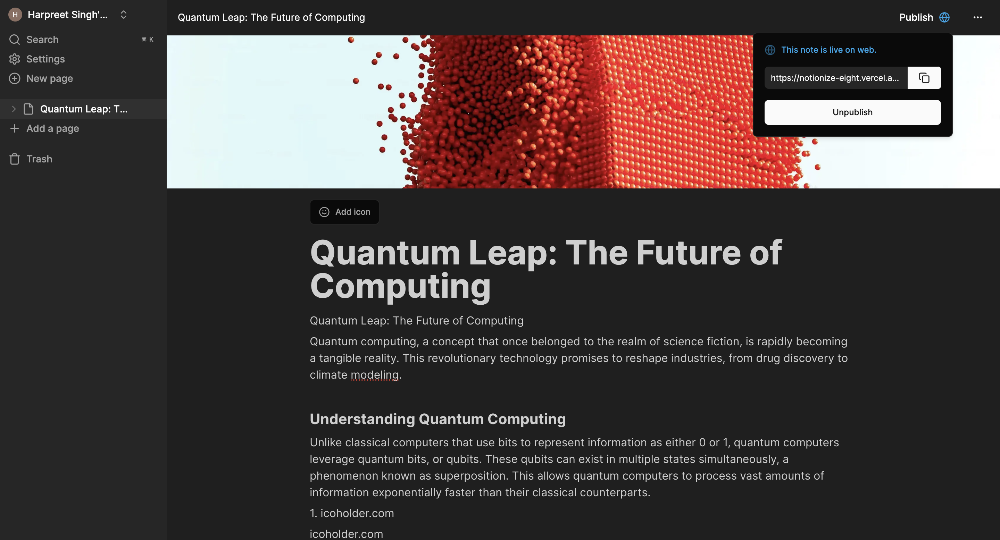

# Neuron

Notionize is an open-source project offering a powerful and customizable workspace for managing your notes, tasks, and projects. Inspired by Notion, it empowers users to create and structure content with ease.

## Features

- **Flexible Page Structure**: Build your workspace with a combination of pages, databases, and diverse content blocks.
- **Rich Text Editing**: Craft beautiful and organized documents with various text styles, formatting options, and embedded content.
- **Drag-and-Drop Functionality**: effortlessly arrange your content for a personalized workflow.
- **Live Preview**: See your work come to life as you edit, ensuring your content looks exactly as you intend.
- **Real-time Collaboration (Coming Soon!)**: Work seamlessly with others on projects in real-time (under development).

## Screenshots

Here are some screenshots of Neuron in action:

